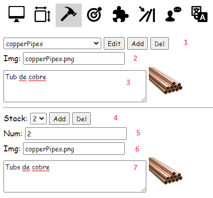

# Editor Manual
- [How to Install](#how-to-install)
- [Folder structure](#folder-structure)
- [Images](#images)
- [URL structure](#url-structure)
- [Main window](#main-window)
  - [Canvas](#canvas)
  - [Down menu](#down-menu)
  - [Right menu](#right-menu)
    - [Screens](#screens)
    - [Areas](#areas)
    - [Objects](#objects)
    - [Objectives](#objectives)
    - [Mixtures](#mixtures)
    - [Triggers](#triggers)
    - [Characters and Talks](#characters-and-talks)
        - [Talks](#talks)
    - [Languages](#languages)
    - [Interactions](#interactions)
        - [Conditions](#conditions)
            - [Has object](#has-object)
            - [Objective completed](#objective-completed)
            - [Area has state](#area-has-state)
        - [Actions](#actions)
            - [Go to](#go-to)
            - [Pick up object](#pick-up-object)
            - [Remove object](#remove-object)
            - [Hide area](#hide-area)
            - [Show area](#show-area)
            - [Show text](#show-text)
            - [Complete objective](#complete-objective)
            - [Area change state](#area-change-state)
            - [Screen change image](#screen-change-image)
            - [Talk](#talk)

## How to Install
To install the engine in your local computer you only need to have [nodeJS](https://nodejs.org/en/) installed on your computer. Download the project in a Zip file or clone the repo and run:
```
npm install
npm start
```
And visit `http://localhost:3000` on your browser.

From there you can go and play the example game (Safari) or edit it. For the purposes of this manual go to Edit the Safari game: `http://localhost:3000/editor/safari`

## Folder structure
Before we start let's talk about the folder structure of the project.

The games are called also stages and stored inside the `public/stage` folder. Each subfolder is a different game. Git will ignore the games starting with `p_` (i.e: p_my-game) as they are supposed to be personal games.

Inside each game the structure is as follows:
```
├── stage.json
└── img
    ├── areas
    ├── characters
    ├── objects
    └── screens
```
The `stage.json` file contains the structure of all the game in JSON format.

The `img` folder contains the images for each element of the game.

## Images
Each element of the game that has images has its own folder. as explained in [folder structure](#folder-structure). But there are 3 ways of adding images in the game. In the input where you have to enter the image you can:
1. Add the image name and put the image into the folder (`/public/stages/folder_name/img/image_folder`)
2. Add the http url of the image (in case the image is from the internet)
3. Add the base64 string of the image (data:image/...)

The recommended method is (1). (2) has the problem that the image can be removed from internet and (3) will make the stage.json file to grow bigger and bigger with each image (but it's interesting if you want a unique file to contain all the game),

## URL structure
Being `http://localhost:3000` the base url you can type directly right after:
- /editor (to go to the editor)
- /editor/*folder-name* (to go to the editor and load the game inside public/stage/*folder-name*)
- /game/*folder-name* (to go to the game saved inside public/stage/*folder-name*)

## Main window
The editor window is divided in 3 zones

<kbd></kbd>

- The [canvas](#canvas)
- a [menu](#down-menu) on its bottom 
- a [menu](#right-menu) on its right

### Canvas
The canvas is where you can see how you screen will look like. Basically you can see the background of the [Screen](#screens) and the different[areas](#areas):

<kbd></kbd>

As you can see the areas had a sorrounding box. With line:
- yellow for normal areas
- red for the selected area
- orange for not visible areas (explained in the [areas](#areas) section)
- dark red for a selected not visible area

These lines can be hidden from the [down menu](#down-menu). Moreover if you click an area it will automatically be selected in the [areas](#areas) menu.

### Down menu
The menu in the bottom is where the general game properties are:

<kbd></kbd>

1. Folder name of your game: (i.e: if your game resides in `public/stage/safari` then your folder name is `safari`)
2. Stage name: This is what will appear as the title of the game
3. Stage version: This is the version of your game in a format major.minor (i.e: 4.7 where the 4 is the major and 7 is the minor). Before you deploy your game for the first time it is recommended to put version 1.0 in this field and if you find things to change in the future and want to deploy another version you can:
    - increment the major (2.0) in case you want to invalidate the savegames of the players (i.e: adding an object to the game)
    - increment the minor (1.1) in case you don't want to invalidate the savegames (i.e: typo fixes)
4. Screen width in pixels: The screen has a fixed height of 544px so depending on your background images you can calculate the correspondent widht and put it here. It is not recommended to change it later (at least not decrease it because some areas could land outside the screen)
5. Default language (flag): currently there are 3 different languages (english, catalan, spanish) and you can select the default one in the [languages](languages) menu.
6. Areas to show: This options refers to the outlined boxes of the areas (which colors are explained in the [canvas](#canvas) section). You can choose between:
    - All: shows all areas with sorrounding boxes
    - Visible: shows only the visible areas
    - No lines: shows all areas without sorrounding boxes
    - No lines-visible: shows only the visible areas without sorrounding boxes
7. Try it! Button: Opens a new window to try quickly the game you are editing<sup>*</sup>
8. Get json Button: Opens a dialog with the json containing all the game. Here you can:
    - copy and paste it in the `stage.json` file inside your game [folder](#folder-structure)
    - click save and it will download a `stage.json` file for you to copy inside your game [folder](#folder-structure)
9. Load json Button: Here you can load a `stage.json` file
10. Restore json Button: 

*: You can use it to quickly check your changes but once validated it is recommended to get the json and save it to the folder of your game. You can always visit the most updated version of the game going to `http://localhost:3000/game/folder-name` as described in [urls](#url-structure) section

### Right menu
The menu in the right is where all the *magic* happens. You can do a lot of things here. For easier use it is divided in these submenus:

<kbd></kbd>

1. [Screens](#screens)
2. [Areas](#areas)
3. [Objects](#objects)
4. [Objectives](#objectives)
5. [Mixtures](#mixtures)
6. [Triggers](#triggers)
7. [Characters and Talks](#characters-and-talks)
8. [Languages](#languages)

#### Screens
Here you can add screens(zones/locations) to your game.

<kbd></kbd>

1. Here you manage the list of screens. Each one has a name and an [image](#images)
2. Mark this to mark your initial screen (the one where you have the game to start). Last one marked will prevail
3. A screen can have various images. Imagine a room with a door: you can have one image with the room open and another with the room closed. Or one image if later in the game the night falls. Here you can manage the list of images and mark one as default. Later you could change the image in the game via [interactions](#interactions)

#### Areas
Here you can add areas (boxes/squares) to your screens. Areas are zone where the user can click (or will be able to click further in the game). Areas can contain images.

<kbd></kbd>

1. Here you manage the list of areas
2. Here you manage the list of states of each area. All areas have a default state and you can add as many as you want. For each non-default state, the default state parameters are taken as defaults (forgive the redundancy). A state contains these parameters:
    - name
    - image
    - description
    - coordinates (x, y)
    - size (height, width)
    - z-index parameter
    - alpha parameter
    - cursor
    - is hidden parameter
3. A default transparent base64 image is set but you can add any  [image](#images)
4. The description that will appear when you hover over the area
5. Coordinates (x, y) and size (height, width) are easier set with the mouse in the [canvas](#canvas) window. Dragging the area you can set the coordinates, and expanding it from the down-right corner you can set the size.
6. Setting the z-index (natural numbers) you can control what areas appear in fornt of which areas. As bigger the z-index more nearer to the user will be the area. Setting the alpha parameter (decimal number from 0 to 1) you can control the transparency of the area being 0 totally transparent and 1 totally opaque (i.e: you can create ghosts setting it 0.5)
7. You can set if an object is visible or not for the user (it can be usefull for showing it later with some [interaction](#interactions)) and also how changes the mouse pointer when the user hovers over it:
    - NONE: the cursor don't change
    - HAND: usefull for objects you can pick up
    - BUBBLE: usefull for characters and conversations
    - EYE: usefull for inspecting areas
    - ARROW_UP, ARROW_RIGHT, ARROW_DOWN, ARROW_LEFT: usefull for navigation between screens
8. Here you can manage [interactions](#interactions)

#### Objects
Here you can manage the inventory objects.

<kbd></kbd>

1. Here you manage the objects names
2. Set an [image](#images)
3. Set a description for when you hover over it or you select it
4. Here you can manage if you have more than one object of the same kind (stacks)
5. For each stack you have to select how many objects of the same kind to apply it (it is important to enter the stacks in ascending order)
6. You can set a different [image](#images). I.e: when you have more than 10 coins you can use an image with a pile of coins
7. You can set a different description too. I.e: lots of coins

#### Objectives
Here you can manage the game objectives.

<kbd></kbd>

Objectives are useful for [interaction conditions](#conditions). In some cases you have to change some behaviour if the user had done something then you can use an objective.

For example imagine that a character in the game `X` tells you that he needs a haircut. In another screen you found a barber shop. You can set an objective `barberShopFound` and mark it as completed when you inspect this barber shop. Later when you return to `X` you can see new conversation option that unlocks only when the objective `barberShopFound`is completed: `If you go down this street you will find a barber shop`

#### Mixtures
Here you can manage the game mixtures/combinations. A mixture is when in the game the user selects an object of the inventory and combines it with another object of the inventory or with a screen area.

<kbd></kbd>

1. Here you can write a default messages for all mixtures that don't an interaction
2. Here you select the mixture:
    - A mixture is composed of the object the user selects first (first list) and the object or area the user want to interact with (second list)
    - Each one of the lists have a filter field and the second list have the option to hide all the elements that starts with `goTo` (to take advantage of this option you have to name the areas of the screen than leads to movement between screens with `goTo`. I.e: `goToKitchen`)
    - The elements with green background of the first list are those than either have an interaction with an element of the second list or have a default description (3)
    - The elements with green background of the second list are those than have an interaction with a element of the first list
    - If you create an interaction between two objects (not an object and an area) the interaction between `obj1` and `obj2` is created. The interaction between `obj2` and `obj1` altough it isn't created will be executed when playing the game unless you create a different interaction between `obj2` and `obj1` then this one will take preference. I. e: you create an interaction between `scissors` and `paper` to cut the paper in two. This action will be executed if the user selects first the scissors or if selects first the paper. But if you create another interaction between `paper` and `scissor` to wrap the scissors in paper then it depends on the first selection of the user which action is executed
3. Here you can write a default message for the selected object of the first list that don't have an interaction
4. Here you can manage [interactions](#interactions)

#### Triggers
Here you can manage the game triggers. Triggers are very similar to [interactions](#interactions). Each time an [action](#action) is executed the game checks which triggers have all their [conditions](#conditions) evaluated to true and for these triggers execute their [actions](#action). When you create or edit a trigger it is recommended than you select to be executed only once (if not the trigger will be executed after each user action if their conditions are all true) or add some interaction to invalidate one of the trigger conditions.

<kbd></kbd>

#### Characters and Talks
Here you can manage the game characters and talks/conversations

<kbd></kbd>

1. Here you manage the characters. By default the first character you add is the main character but you can change it later
2. Set an [image](#images) for the character
3. Set a font color for the character
4. Set the default character. There is only one main character and the only difference between the other characters is that when it talks, his name is not shown (because you know who you are)
5. Here you manage the [talks](#talks). If a talk has multiple responses there is a `(M)` at the beggining of the dropdown.

##### Talks
A talk is a character saying something. If the list of possible options (the ones which their conditions are all true) of a talk is only one the character will say the response automatically. Otherwise, the player will choose which option the character will say (it applies to all characters not only to the main one). It is recommended that one option is always possible.

<kbd></kbd>

Once you edit a talk you can set different things:

<kbd></kbd>

1. The sentence to be said
2. [Conditions](#conditions) to show the answer
3. [Interactions](#interactions) to execute once the answer is said (choosen manually or automatically)

#### Languages
Here you can manage the game languages/translations/i18n. By default the english language is selected.

<kbd></kbd>

1. Here you can manage the game translations (actually only english, catalan and spanish are supported)
2. You can set the default language in which you are editing the game
3. When you want to translate your game you have to follow this procedure:
    1. Export will create a file with all texts with its translations if already translated earlier or with the default language text otherwise
    2. You have to translate the texts of the file following the format `idxxxx|||text_to_translate|||`. It is important that you don't change the ids neither the separators (the final one is important to manage multiline texts) neither add blank spaces
    3. Import the file with the translations in the desired language and you are set!

#### Interactions
Interactions can be defined in varius menus in the editor but they all are the same. A list of interactions are defined and the first of them that all their [conditions](#conditions) are true gets all its [actions](#actions) are executed.

<kbd></kbd>

1. Here you can manage the list of interactions. Remember that the order that you define them is important because it will only be executed the first one which their [conditions](#conditions) are all true.
2. You can set an interaction to be executed only once. Once executed it will never be executed again.
3. Here you can manage the list of [conditions](#conditions)
4. Here you can manage the list of [actions](#actions)

##### Conditions
There are three types of conditions, all of them can be negated (having a total of 6 types of conditions):
1. [Has object](#has-object)
2. [Objective completed](#objective-completed)
3. [Area has state](#area-has-state)

###### Has object
Return true if the user have the desired number of objects in the inventory.

<kbd></kbd>

Select the desired object and the number of object of that type.

###### Objective completed
Return true if the user has completed the selected objective.

<kbd></kbd>

Select the objective.

###### Area has state
Return true if the selected area has the selected state.

<kbd></kbd>

Select the screen to update the list of areas, then select the area and finally select the state.

##### Actions
There are ten types of actions:
1. [Go to](#go-to)
2. [Pick up object](#pick-up-object)
3. [Remove object](#remove-object)
4. [Hide area](#hide-area)
5. [Show area](#show-area)
6. [Show text](#show-text)
7. [Complete objective](#complete-objective)
8. [Area change state](#area-change-state)
9. [Screen change image](#screen-change-image)
10. [Talk](#talk)

###### Go to
Sends the player to the selected screen.

<kbd></kbd>

Select the screen.

###### Pick up object
Adds to the inventory the selected number of objects

<kbd></kbd>

Select the object and the number of items to add to the inventory.

###### Remove object
Remove from the inventory the selected number of objects.

<kbd></kbd>

Select the object and the number of items to remove from the inventory (It is recommended to check that the user [Has that many objects](#has-object)).

###### Hide area
Hides/Removes an area to the player, making impossible to select it.

<kbd></kbd>

Select the screen to update the list of areas, then select the area to hide.

###### Show area
Shows an area to the player (usually a hidden one), making possible to select it.

<kbd></kbd>

Select the screen to update the list of areas, then select the area to show.

###### Show text
Shows a text to the player via a dialog box.

<kbd></kbd>

Write the text to show. It can contain line breaks.

###### Complete objective
Marks an objective as completed.

<kbd></kbd>

Select the objective to complete.

###### Area change state
Changes the state of an area to the selected one.

<kbd></kbd>

Select the screen to update the list of areas, then select the area and finally select the state.

###### Screen change image
Changes the screen image to the selected one.

<kbd></kbd>

Select the screen, then select the [image](#screens).

###### Talk
Starts a conversation with the given talk.

<kbd></kbd>

Select the talk to start the conversation with. You can filter for any word appearing in the conversation, even for the character or the `(M)` that means that has multiple options.
